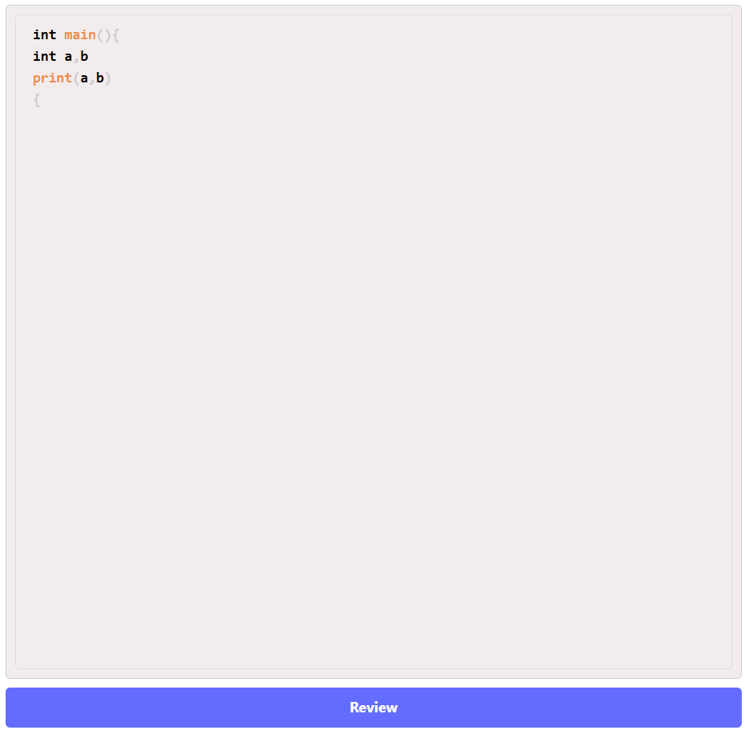
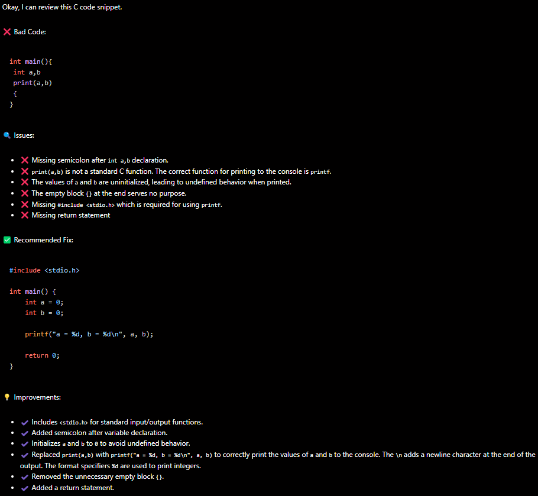

# AI Code Review 🤖

A modern code review assistant powered by Google's Gemini AI 2.0. Get instant, intelligent feedback on your JavaScript code with syntax highlighting and real-time analysis.

## Features ✨

- **Real-time Code Editing**: Built-in code editor with syntax highlighting powered by Prism.js
- **AI-Powered Analysis**: Leverages Gemini AI 2.0 for intelligent code review
- **Markdown Support**: Review feedback rendered in beautiful markdown with code highlighting
- **Modern UI**: Clean, intuitive interface with split-pane layout
- **Instant Feedback**: One-click code review process

## Tech Stack 🛠️

### Frontend
- React
- react-simple-code-editor
- Prism.js for syntax highlighting
- react-markdown for rendering reviews
- Axios for API calls

### Backend
- Google Gemini AI 2.0
- Node.JS

## Usage 💡

1. Enter or paste your code in the left editor panel
2. Click the "Review" button to generate AI feedback
3. View the detailed analysis in the right panel with formatted markdown and syntax highlighting

## Acknowledgments 🙏

- Google Gemini AI
- React Community
- Prism.js Contributors
- All other open-source contributors

---

Made with ❤️ by Abhik Samanta